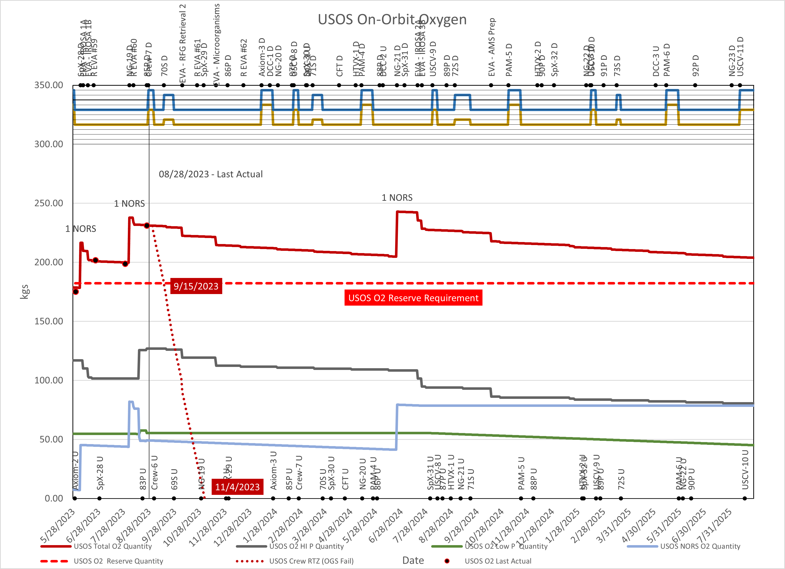

# Guide to Packaged Data

## Data Package Overview
[Full Overview of all data sets](./data_package_overview.md)

## Example Analysis

## Data Dictionaries
Data definitions provided by Devin Vyain.

[IMS Data Dictionary](./ims-data-dictionary.md) - the big one

[Flight Plan Dictionary](./iss-flight-plan-dictionary.md)

[Flight Plan Crew Dictionary](./flight-plan-crew-dictionary.md)

[USOS Water Dictionary](./usos-water-dictionary.md)

[RSA Water Dictionary](./rsa-water-dictionary.md)

[US and RS Gas Dictionary](./us-and-rs-gas-dictionary.md)